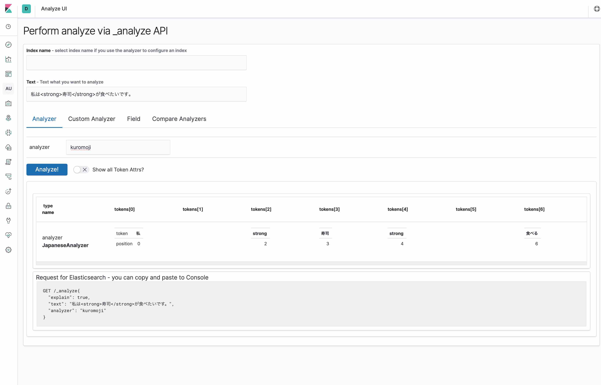

# analyze-api-ui-plugin

> UI for elasticsearch analyze API

Analyze text with Aalyzer

This branch is for Kibana 7.x.

## How to use?

See [Getting Started](docs/GETTING_STARTED.md)

## Installation
The latest stable version is for kibana 7.4.1.

| Kibana version | Command |
| ---------- | ------- |
| 7.4.1 | `./bin/kibana-plugin install https://github.com/johtani/analyze-api-ui-plugin/releases/download/7.4.1/analyze_api_ui-7.4.1.zip`
| 7.4.0 | `./bin/kibana-plugin install https://github.com/johtani/analyze-api-ui-plugin/releases/download/7.4.0/analyze_api_ui-7.4.0.zip`
| 7.3.2 | `./bin/kibana-plugin install https://github.com/johtani/analyze-api-ui-plugin/releases/download/7.3.2/analyze_api_ui-7.3.2.zip`
| 7.3.1 | `./bin/kibana-plugin install https://github.com/johtani/analyze-api-ui-plugin/releases/download/7.3.1/analyze_api_ui-7.3.1.zip`
| 7.3.0 | `./bin/kibana-plugin install https://github.com/johtani/analyze-api-ui-plugin/releases/download/7.3.0/analyze_api_ui-7.3.0.zip`
| 7.2.0 | `./bin/kibana-plugin install https://github.com/johtani/analyze-api-ui-plugin/releases/download/7.2.0/analyze_api_ui-7.2.0.zip`
| 7.1.1 | `./bin/kibana-plugin install https://github.com/johtani/analyze-api-ui-plugin/releases/download/7.1.1/analyze_api_ui-7.1.1.zip`
| 7.1.0 | `./bin/kibana-plugin install https://github.com/johtani/analyze-api-ui-plugin/releases/download/7.1.0/analyze_api_ui-7.1.0.zip`
| 7.0.1 | `./bin/kibana-plugin install https://github.com/johtani/analyze-api-ui-plugin/releases/download/7.0.1/analyze_api_ui-7.0.1.zip`
| 7.0.0 | `./bin/kibana-plugin install https://github.com/johtani/analyze-api-ui-plugin/releases/download/7.0.0/analyze_api_ui-7.0.0.zip`

  
Older versions (6.7.1 - 6.1.2)

| Kibana version | Command |
| ---------- | ------- |
| 6.7.1 | `./bin/kibana-plugin install https://github.com/johtani/analyze-api-ui-plugin/releases/download/6.7.1/analyze-api-ui-plugin-6.7.1.zip`
| 6.7.0 | `./bin/kibana-plugin install https://github.com/johtani/analyze-api-ui-plugin/releases/download/6.7.0/analyze-api-ui-plugin-6.7.0.zip`
| 6.6.2 | `./bin/kibana-plugin install https://github.com/johtani/analyze-api-ui-plugin/releases/download/6.6.2/analyze-api-ui-plugin-6.6.2.zip`
| 6.6.1 | `./bin/kibana-plugin install https://github.com/johtani/analyze-api-ui-plugin/releases/download/6.6.1/analyze-api-ui-plugin-6.6.1.zip`
| 6.6.0 | `./bin/kibana-plugin install https://github.com/johtani/analyze-api-ui-plugin/releases/download/6.6.0/analyze-api-ui-plugin-6.6.0.zip`
| 6.5.4 | `./bin/kibana-plugin install https://github.com/johtani/analyze-api-ui-plugin/releases/download/6.5.4/analyze-api-ui-plugin-6.5.4.zip`
| 6.5.3 | `./bin/kibana-plugin install https://github.com/johtani/analyze-api-ui-plugin/releases/download/6.5.3/analyze-api-ui-plugin-6.5.3.zip`
| 6.5.2 | `./bin/kibana-plugin install https://github.com/johtani/analyze-api-ui-plugin/releases/download/6.5.2/analyze-api-ui-plugin-6.5.2.zip`
| 6.5.1 | `./bin/kibana-plugin install https://github.com/johtani/analyze-api-ui-plugin/releases/download/6.5.1/analyze-api-ui-plugin-6.5.1.zip`
| 6.5.0 | `./bin/kibana-plugin install https://github.com/johtani/analyze-api-ui-plugin/releases/download/6.5.0/analyze-api-ui-plugin-6.5.0.zip`
| 6.4.3 | `./bin/kibana-plugin install https://github.com/johtani/analyze-api-ui-plugin/releases/download/6.4.3/analyze-api-ui-plugin-6.4.3.zip`
| 6.4.2 | `./bin/kibana-plugin install https://github.com/johtani/analyze-api-ui-plugin/releases/download/6.4.2/analyze-api-ui-plugin-6.4.2.zip`
| 6.4.1 | `./bin/kibana-plugin install https://github.com/johtani/analyze-api-ui-plugin/releases/download/6.4.1/analyze-api-ui-plugin-6.4.1.zip`
| 6.4.0 | `./bin/kibana-plugin install https://github.com/johtani/analyze-api-ui-plugin/releases/download/6.4.0/analyze-api-ui-plugin-6.4.0.zip`
| 6.3.2 | `./bin/kibana-plugin install https://github.com/johtani/analyze-api-ui-plugin/releases/download/6.3.2/analyze-api-ui-plugin-6.3.2.zip`
| 6.3.0 | `./bin/kibana-plugin install https://github.com/johtani/analyze-api-ui-plugin/releases/download/6.3.0/analyze-api-ui-plugin-6.3.0.zip`
| 6.2.4 | `./bin/kibana-plugin install https://github.com/johtani/analyze-api-ui-plugin/releases/download/6.2.4/analyze-api-ui-plugin-6.2.4.zip`
| 6.2.3 | `./bin/kibana-plugin install https://github.com/johtani/analyze-api-ui-plugin/releases/download/6.2.3/analyze-api-ui-plugin-6.2.3.zip`
| 6.2.2 | `./bin/kibana-plugin install https://github.com/johtani/analyze-api-ui-plugin/releases/download/6.2.2/analyze-api-ui-plugin-6.2.2.zip`
| 6.2.1 | `./bin/kibana-plugin install https://github.com/johtani/analyze-api-ui-plugin/releases/download/6.2.1/analyze-api-ui-plugin-6.2.1.zip`
| 6.2.0 | `./bin/kibana-plugin install https://github.com/johtani/analyze-api-ui-plugin/releases/download/6.2.0/analyze-api-ui-plugin-6.2.0.zip`
| 6.1.3 | `./bin/kibana-plugin install https://github.com/johtani/analyze-api-ui-plugin/releases/download/6.1.3/analyze-api-ui-plugin-6.1.3.zip`
| 6.1.2 | `./bin/kibana-plugin install https://github.com/johtani/analyze-api-ui-plugin/releases/download/6.1.2/analyze-api-ui-plugin-6.1.2.zip`

## Known issues

* not restore filters/char_fiters after moving another tabs [#42](https://github.com/johtani/analyze-api-ui-plugin/issues/42)

## TODO 

* change index name to select
    * preload index_name from _cat/indices
* error handling

---

## development

See the [kibana contributing guide](https://github.com/elastic/kibana/blob/master/CONTRIBUTING.md) for instructions setting up your development environment. Once you have completed that, use the following npm tasks.

  - `npm start`

    Start kibana and have it include this plugin

  - `npm start -- --config kibana.yml`

    You can pass any argument that you would normally send to `bin/kibana` by putting them after `--` when running `npm start`

  - `npm run build`

    Build a distributable archive

  - `npm run test:browser`

    Run the browser tests in a real web browser

  - `npm run test:server`

    Run the server tests using mocha

For more information about any of these commands run `npm run ${task} -- --help`.
