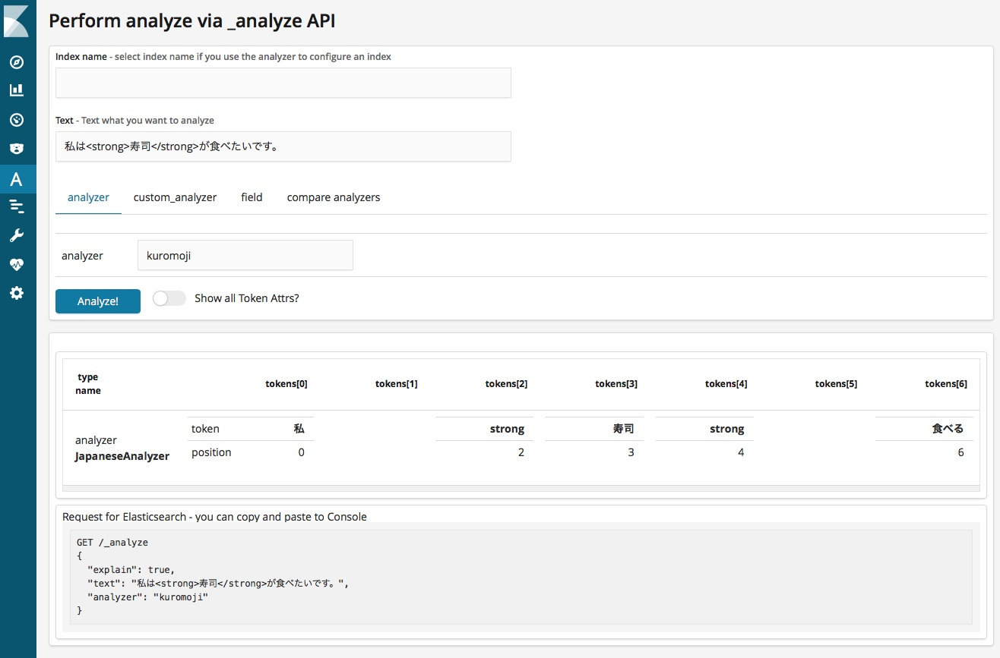
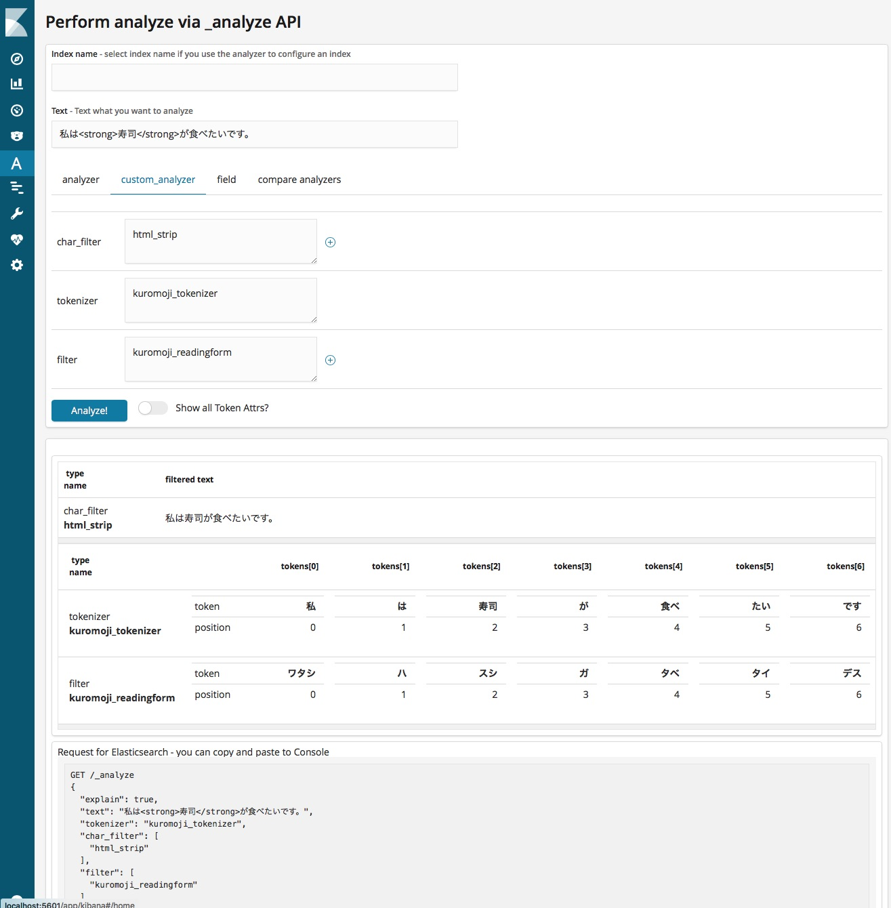

# analyze-api-ui-plugin

> UI for elasticsearch analyze API

Analyze text with Aalyzer

Analyze text with custom analyzer

## Installation
The latest version is for kibana 6.2.4.

| Kibana version | Command |
| ---------- | ------- |
| 6.2.4 | `./bin/kibana-plugin install https://github.com/johtani/analyze-api-ui-plugin/releases/download/6.2.4/analyze-api-ui-plugin-6.2.4.zip`
| 6.2.3 | `./bin/kibana-plugin install https://github.com/johtani/analyze-api-ui-plugin/releases/download/6.2.3/analyze-api-ui-plugin-6.2.3.zip`
| 6.2.2 | `./bin/kibana-plugin install https://github.com/johtani/analyze-api-ui-plugin/releases/download/6.2.2/analyze-api-ui-plugin-6.2.2.zip`
| 6.2.1 | `./bin/kibana-plugin install https://github.com/johtani/analyze-api-ui-plugin/releases/download/6.2.1/analyze-api-ui-plugin-6.2.1.zip`
| 6.2.0 | `./bin/kibana-plugin install https://github.com/johtani/analyze-api-ui-plugin/releases/download/6.2.0/analyze-api-ui-plugin-6.2.0.zip`
| 6.1.3 | `./bin/kibana-plugin install https://github.com/johtani/analyze-api-ui-plugin/releases/download/6.1.3/analyze-api-ui-plugin-6.1.3.zip`
| 6.1.2 | `./bin/kibana-plugin install https://github.com/johtani/analyze-api-ui-plugin/releases/download/6.1.2/analyze-api-ui-plugin-6.1.2.zip`

## TODO 

* change index name to select
    * preload index_name from _cat/indices
* error handling

---

## development

See the [kibana contributing guide](https://github.com/elastic/kibana/blob/master/CONTRIBUTING.md) for instructions setting up your development environment. Once you have completed that, use the following npm tasks.

  - `npm start`

    Start kibana and have it include this plugin

  - `npm start -- --config kibana.yml`

    You can pass any argument that you would normally send to `bin/kibana` by putting them after `--` when running `npm start`

  - `npm run build`

    Build a distributable archive

  - `npm run test:browser`

    Run the browser tests in a real web browser

  - `npm run test:server`

    Run the server tests using mocha

For more information about any of these commands run `npm run ${task} -- --help`.
