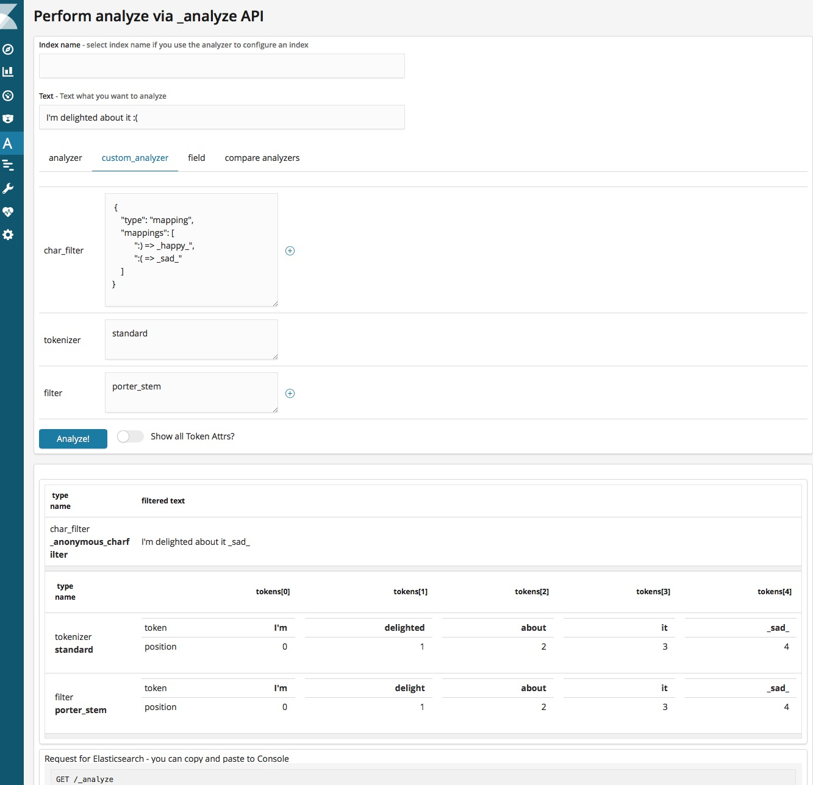
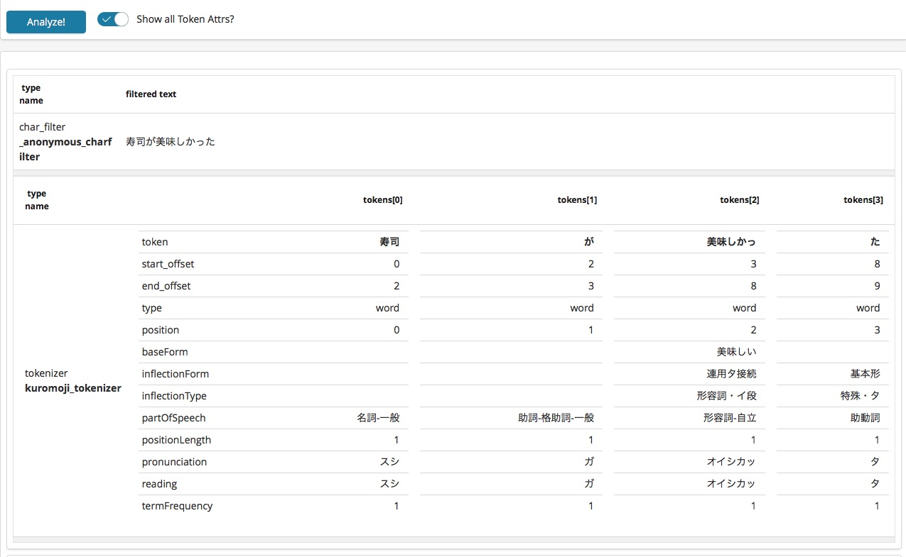
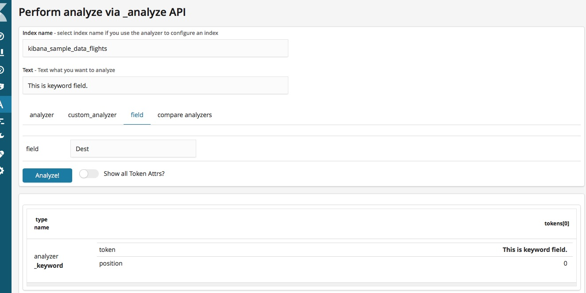
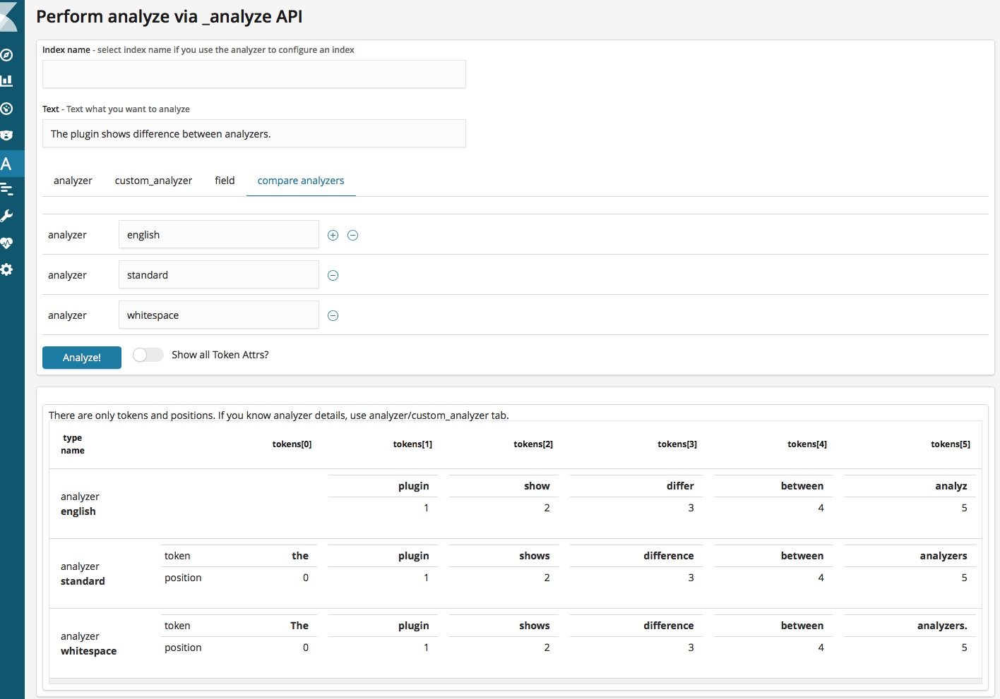

# Getting Started Analuze UI Plugin

## What is this?

This Kibana plugin is the UI for [Elasticsearch _analyze API](https://www.elastic.co/guide/en/elasticsearch/reference/current/indices-analyze.html).
The _analyze API is great for understanding how to work analysis process in Elasticsearch, 
but JSON response isn't human-readable if text is long or `explain=true` parameter is used.

This plugin will show analyzed result more readable :)
The plugin have some features, let's show how it works.
And it also show the request syntax for Console under the table.

## 1. Show analyzed result of built-in analyzer

This is simplest use-case for this plugin.
Choose `analyzer` tab and fill two text inputs.

1. Text - Text what you want to analyze
2. Analyzer - Built-in analyzer name, e.g. `standard`

Then click `Analyze!` button, it will show a list of `tokens`.


## 2. Show analyzed result of defined analyzer in index

If you want to see analyzed result of the analyzer that you define in index,
you can specify your index name and analyzer name.
Choose `Analyzer` tab and fill three text inputs.

1. Index name - Index name what define an analyzer you want to use
2. Text - Text what you want to analyze
3. Analyzer - your analyzer name

Then click `Analyze!` button, it will show a list of `tokens`.

## 3. Show analyzed result of custom analyzer

If you want to test a combination of char_filter/tokenizer/filter before defining your custom analyzer, 
you can use `custom_analyzer` tab.
Choose `custom_analyzer` tab and fill char_filter/tokenizer/filter text inputs.

1. Text - Text what you want to analyzer
2. char_filter - char_filter name/custom char_filter if you need
3. tokenizer - tokenizer name
4. filter - filter name/custom filter if you need

Then click `Analyze!` button, it will show lists of text and `tokens`.



If you want to use multiple char_filters/filters, click `plus` icon.
The plugin will show new text input.

You can also specify custom char_filter/tokenizer/filter as follow:

```JSON
 {
    "type": "mapping",
    "mappings": [
          ":) => _happy_",
          ":( => _sad_"
    ]
}
```

The example is char_filter with custom mapping.


## 4. Show more token attributes in the result

Lucene analysis module provides many token attributes for each tokens.
e.g. Kuromoji tokenizer outputs token attributes like `partOfSpeech`, `reading`, 'baseForm', etc.
However, this plugin shows only `token` and `position` by default.
If turn on `Show all Token Attrs?` switch that next to `Analyze!` button, 
the plugin shows all token attributes in the result table.
It also works after clicking `Analyze!` button. 




## 4. Show analyzed result of a field in the index mapping

If you want to analyze text with existing field, 
you can specify your index name and "field name".

1. Index name - Index name what define an analyzer you want to use
2. Text - Text what you want to analyze
3. Field - your field name

Then the plugin shows lists of tokens that are provided by the analyzer that is defined to the field.



## 5. Compare analyzed results between some analyzers

The plugin also shows a comparison of list of tokens that are provided by each analyzers you put in form.

 
